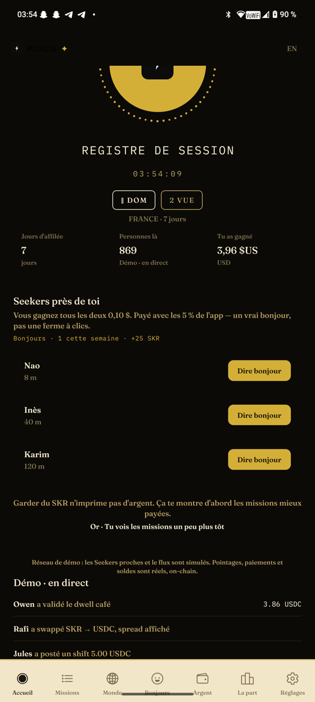
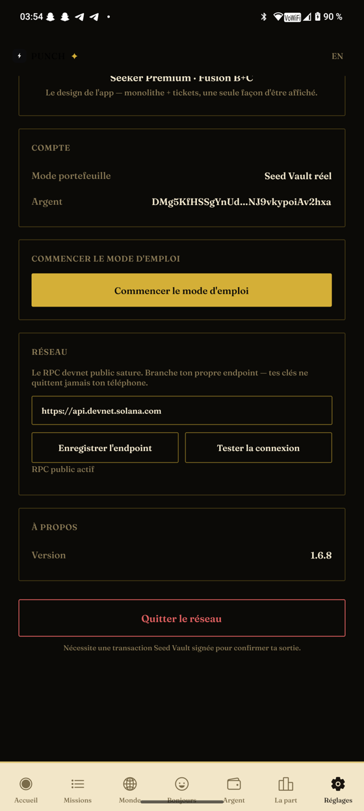

# Soumettre PUNCH à CLOCK IN

## 1. L'essentiel

| | |
|---|---|
| **Hackathon** | CLOCK IN — 3ᵉ hackathon Solana Mobile, organisé par RadiantsDAO (annoncé le 8 sept sur le blog Solana Mobile) |
| **Dates** | Inscription & soumissions : **8 sept → 9 oct 2026, 08:59 (UTC+2)** · Jugement : 10 oct → 9 nov · Résultats : **11 novembre 2026** |
| **Plateforme officielle** | **https://solanamobile.radiant.nexus/** (création de compte + soumission du projet) — à faire avec ton compte, je ne peux pas le faire à ta place |
| **Prix** | **$135 000 au total** : $125 000 USDC (1ᵉʳ $30k, 2ᵉ $25k, 3ᵉ $20k, 4ᵉ $15k, 5ᵉ $10k, 6ᵉ-10ᵉ $5k chacun) + **$10 000 en SKR** pour la meilleure intégration SKR (prix séparé, optionnel) |
| **Bonus gagnants** | Publication dApp Store, mise en avant, co-marketing, Seeker pour l'équipe, appel avec Anatoly Yakovenko |
| **Support** | Workshops hebdomadaires sur le **Discord Radiants** |

## 2. Les 4 livrables obligatoires — état pour PUNCH

| Livrable | État | Lien / action |
|---|---|---|
| **APK Android fonctionnel** | ✅ prêt (v1.6.8, arm64, signé, **construit en CI avec le vrai trésor**) | https://github.com/Azumizeus/punch-clockin/releases/tag/v1.6.8 |
| **Repo GitHub source** | ✅ prêt, **public**, CI verte | https://github.com/Azumizeus/punch-clockin |
| **Vidéo démo** | ✅ refaite le 22/09 (2 min 43, voix off EN + **sous-titres incrustés**, tournée sur Seeker v1.6.6 : connexion, pointage complet → ticket, reçu 92/3/5, ping RPC, explorer). **Séquence Réseau re-tournée sur Seeker v1.6.8 le 26/09** : ping public vert (249 ms) → endpoint faux → erreur honnête (`UnknownHostException` réel) → retour public → re-ping vert (254 ms) — voir `punch-demo-reseau-v168.mp4` dans la release v1.6.8 | `punch-clockin-demo.mp4` dans la release v1.6.7 (+ `.srt`) — **à uploader sur YouTube (public ou répertorié)** et lier |
| **Pitch deck** | ✅ prêt | [`docs/punch-clockin-deck.pdf`](https://github.com/Azumizeus/punch-clockin/blob/master/docs/punch-clockin-deck.pdf) (11 slides EN, dont la diapo de preuve Réseau/Version v1.6.8) |

### Preuves visuelles du livrable 1 (captures Seeker v1.6.8)

| Accueil | Réglages (Réseau · Version · Quitter) |
|---|---|
|  |  |

À gauche : l'accueil connecté, avec l'étiquette **« Démo · en direct »** sur les données sociales simulées (honnêteté assumée). À droite : les Réglages montrent le test RPC (**« RPC public actif »**), la **Version 1.6.8** et la sortie signée **« Quitter le réseau »**. Ces captures sont régénérées par `punch-native/scripts/device/vitrine.py` ; leurs SHA-256 sont tracés dans [`site/device/MANIFEST.json`](site/device/MANIFEST.json) — **aussi embarqué comme [asset de la release v1.6.8](https://github.com/Azumizeus/punch-clockin/releases/download/v1.6.8/MANIFEST.json) pour la traçabilité hors repo** — et vérifiés en CI par le garde-fou `tools/check_device_sync.py`. La page publique [**proof**](https://azumizeus.github.io/punch-clockin/proof.html) affiche ces empreintes (version, date, SHA-256 et poids de chaque capture et de la vidéo), générée automatiquement depuis le MANIFEST et vérifiée elle aussi en CI.

**Démo Réseau re-tournée sur Seeker v1.6.8 (26/09)** — séquence complète capturée en vidéo ([`punch-demo-reseau-v168.mp4`](https://github.com/Azumizeus/punch-clockin/releases/download/v1.6.8/punch-demo-reseau-v168.mp4), 3 min) : ping du RPC public → verdict vert **« Connexion OK · 249 ms »** ; endpoint bidon `rpc-inexistant-punch.example` → erreur honnête **`UnknownHostException`** (la vraie raison, jamais un mensonge) ; **« Revenir au RPC public »** → re-ping vert **254 ms**, avec la **Version 1.6.8** visible sur le même écran. Captures étape par étape dans `punch-native/_shots/reseau-v168/` (01 à 06).

## 3. Critères du jury (4 × 25 %) — comment PUNCH y répond

- **Stickiness & PMF** → rituel quotidien (pointer → missions → paiement), staking SKR qui fidélise, cible naturelle : possesseurs de Seeker.
- **UX** → app 100 % native Expo/RN, ticket papier après pointage, globe à physique réelle, identité Gold/Nuit, visite guidée interactive.
- **Innovation** → la présence humaine devient une monnaie ; règle 92/3/5 imprimée partout, jamais cachée ; « dire bonjour » paie 0,10 $ réels.
- **Présentation & démo** → vidéo déjà montée + `docs/PITCH-JURY.md` + `docs/GUIDE-JURY.md` (test pas-à-pas pour le jury).

Le prix SKR ($10k) vise exactement notre intégration : staking SKR → accès prioritaire aux missions, frais protocole avec rachat SKR. *(Slide 5 du deck : « This is our CLOCK IN SKR-integration entry. »)*

## 4. ✅ Point bloquant résolu — le trésor réel est en CI

Le secret GitHub `TREASURY_SECRET_DEVNET` a été **posé via l'API** (valeur = le tableau JSON des 64 octets, chiffrée libsodium avec la clé publique Actions) et **prouvé par dérivation** : la clé engendre exactement le trésor `FUiCbnDhEEJtz9Zcj66hGB54iGMGeyjRKD7CsTwpihJn`. Le workflow Release **refuse désormais tout build sans secret** (échec tôt avec message d'action) — plus jamais d'APK « gabarit zéro ».

**Dernière vérification avant de soumettre :** le corps de la [release v1.6.8](https://github.com/Azumizeus/punch-clockin/releases/tag/v1.6.8) ne doit pas contenir d'avertissement « gabarit démo » (sinon re-taguer `v1.6.8` pour reconstruire).

**Checklist complémentaire :**
- [x] Liens APK de `README.md` pointés vers la GitHub Release (fait le 22/09)
- [x] `punch-clockin-deck.pdf` exporté et commité
- [x] Tester l'APK de la release sur un vrai Seeker : connexion, pointage, reçu avec signature cliquable
- [ ] Uploader la vidéo sur YouTube et noter le lien (dernière action manuelle avant « Submit »)

## 5. Textes prêts à coller dans le formulaire de soumission

**Project name :**
```
PUNCH — Proof of presence on Solana
```

**One-liner :**
```
Punch in once a day from a real Seeker: a real signed Solana transaction proves you
showed up, and every payment follows one printed rule — 92% worker, 3% SKR holders,
5% app. No fake check-ins, no hidden splits.
```

**Description (EN) :**
```
PUNCH turns human presence into honest money. One tap a day on a Seeker signs a real
memo transaction in Seed Vault — that's your proof of presence. It unlocks small paid
gigs nearby (confirm a place is open, leave an honest review, scan a code), paid in
USDC/USDT. Every money action in the app — punch in, get paid, swap, stake, say-hi,
leave the network — is a real signed devnet transaction through Mobile Wallet Adapter.
The public treasury is live on the explorer: watch balances move while you use the app.

SKR integration: staking SKR gives earlier access to better-paid jobs (real utility,
zero new supply), unstake carries an honest 1.5% protocol fee, and protocol fees
buy back SKR for holders. The 92/3/5 rule is printed on every receipt — never hidden.

100% native (Expo/React Native), signed APK, bilingual judge guide included.
You show up. You get paid. 92 / 3 / 5.
```

**Liens à coller :**
```
GitHub repo (source + judge guide): https://github.com/Azumizeus/punch-clockin
Signed APK (arm64): https://github.com/Azumizeus/punch-clockin/releases/latest
Demo video: <lien-youtube>
Devnet treasury on explorer: https://explorer.solana.com/address/FUiCbnDhEEJtz9Zcj66hGB54iGMGeyjRKD7CsTwpihJn?cluster=devnet
Judge guide: https://github.com/Azumizeus/punch-clockin/blob/master/docs/GUIDE-JURY.md
Proof (SHA-256 of captures & video): https://azumizeus.github.io/punch-clockin/proof.html
Pitch deck: <fichier PDF joint ou lien>
```

**Device gallery (EN) — à coller dans le champ « gallery » / visuels du formulaire :**
```
Device gallery — proof from a real Solana Seeker (v1.6.8)

Both screenshots are captured directly on a physical Solana Seeker running the
signed v1.6.8 build — no mockups, no simulator. On the home screen the app is
connected, with social data honestly labeled "Démo · en direct" — a simulated
live demo, by design. The settings screen shows the built-in network check
("RPC public actif" — public RPC active), the exact app version (1.6.8), and the
signed exit action "Quitter le réseau" (leave the network).

These captures are regenerated straight from the device with one command
(punch-native/scripts/device/vitrine.py). Their SHA-256 hashes are published in
docs/site/device/MANIFEST.json, embedded as a release asset on v1.6.8 for
out-of-repo traceability
(https://github.com/Azumizeus/punch-clockin/releases/download/v1.6.8/MANIFEST.json),
and enforced in CI by tools/check_device_sync.py: if the gallery ever drifts
from what the device produced, the build fails.
What you see online is exactly what the phone produced.

The network check was re-recorded live on this same Seeker (v1.6.8): public RPC
ping green (249 ms), fake endpoint rejected with the real error
(UnknownHostException), back to the public RPC, green again (254 ms). Video:
punch-demo-reseau-v168.mp4, attached to the v1.6.8 release.

See the gallery live: https://azumizeus.github.io/punch-clockin/guide-jury.html
Images: https://azumizeus.github.io/punch-clockin/device/home.png
        https://azumizeus.github.io/punch-clockin/device/settings.png
```

**Argumentaire prix SKR ($10k) — si le formulaire demande la candidature :**
```
1. SKR is the gate to earning power: staking 1,000 / 5,000 / 25,000 SKR unlocks Silver, Gold and
   Guardian ranks that open better-paid missions — real utility, zero new supply, no speculation.
2. The protocol's 5% fee doesn't disappear: it buys back SKR for holders, so every clock-in in the
   app mechanically returns value to people who stake.
3. Unstaking carries an honest 1.5% fee, printed on the receipt like everything else — no hidden
   mechanics, the 92/3/5 rule is on every ticket.
4. Every stake, unstake and reward flow is a real signed Seed Vault transaction on devnet —
   verifiable on explorer.solana.com, nothing simulated.
5. PUNCH makes SKR the trust layer of human presence: you don't hold SKR to trade it, you hold it
   because it makes your daily work pay better. That's what a mobile-native L1 token should be.
```

## 6. Règles d'éligibilité à connaître

- Projet démarré **au plus tôt 3 mois avant le lancement** (8 juin 2026) → OK pour PUNCH (développé en sept. 2026).
- Un projet existant peut participer s'il démontre un **développement mobile significatif pendant le hackathon** → OK.
- Doit intégrer la **Solana Mobile Stack / Mobile Wallet Adapter** et interagir réellement avec Solana → OK (MWA + Seed Vault + transactions devnet réelles).
- Les gagnants doivent **publier l'app sur la dApp Store** pour toucher le prix (délai raisonnable accordé après les résultats) — à anticiper.
- Pas besoin d'un Seeker pour soumettre, mais le build cible Seeker → OK.
